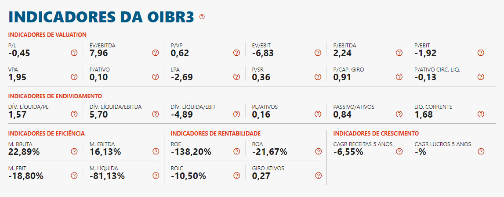

# Índices de um papel



* KPI -> Key Performance Index

---
# 1. P/E - *SEC & Nasdaq*
---

P/E é um indicador de quanto tempo uma ação se paga em anos, se tiver P/E 5, ela se paga em 5 anos,
se for negativo ela NUNCA se paga (OIBR3)

P = Price 
É o preço da ação que você vê na tela.

E = EPS = Earnings per share
é o ganho por ação da empresa na bolsa

Temos que saber o net income da empresa subtrair os dividendos e dividir pelas ações totais da empresa
```sh
EPS = (net income - dividends)/(qtd de ações)
```

**Exemplo:**
Empresa Barraca de Limão do Zuzu (TTM) (Trailing 12 months) (Ultimos 12 meses) 
Faturei  R$ 1.000,00 de net income (Lucro Líquido) e paguei R$ 200,00 de Dividends (Dividendos) e tenho 10 ações na bolsa
Logo
```sh
EPS = (R$ 1.000,00 - R$ 200,00)/10 = R$ 80,00 per share
````
O preço da minha barraca de limão na BOLSA está em torno de 500 reais cada ação
Então o P/E é R$ 500,00 / R$ 80,00 = 6,25

OBS: Na bolsa americana existem 2 quantidades de ações, basic e diluted
Em resumo
**Basic** = Ações que a Empresa disponibilizou na bolsa
**Diluted** = Basic + Ações que eles 'pagam' funcionários, usam como garantia ou convertem para ações preferenciais
Na prática, usar o Diluted você joga mais "safe"


##### 1.1 EPS - *SEC*
---


Como encontrar o EPS de uma empresa
Entre no google e Digite:  [*Empresa*] + Sec Filings

**10-Q = Balanço Trimestral**
**10-K = Balanço Anual**

Como queremos manter nossos índices atualizados, vamos pegar os 4 ultimos 10-Q emitidos pela empresa

Depois de abrir o arquivo, basta apertar CTRL+F e digitar "earnings per share" e você ja tera o EPS calculado pela empresa

**Exemplo:**

Cotação realizada em 16/07/2020

Podemos reparar que em 4 países diferentes, o princípio de encontrar o P/E é o **mesmo**

| Empresa | Ticket | Exchange | Price | EPS | P/E | País |
| ------- | ----- | --- | ----| --- | ----| ----|
| [Amazon](https://d18rn0p25nwr6d.cloudfront.net/CIK-0001018724/4d39f579-19d8-4119-b087-ee618abf82d6.pdf) | AMZN | Nasdaq | $ 2.999,90 | $ 23,01 | 130,4 | Estados Unidos |
| [Nestlé](https://www.nestle.com/sites/default/files/2020-02/2019-financial-statements-en.pdf)| NESN | SIX Swiss | ₣ 108,46 | ₣ 4,30 | 25,22 | Suiça |
| [Volkswagen](https://www.volkswagenag.com/presence/investorrelation/publications/annual-reports/2020/volkswagen/Y_2019_e.pdf) | VOW3 | DAX | 	€ 142,02 | 	€ 26,66 | 5,33 | Alemanha |
| [HDFC Bank](https://www.hdfcbank.com/content/api/contentstream-id/723fb80a-2dde-42a3-9793-7ae1be57c87f/1bcf4f2c-17cc-4759-9081-dcc0f5beeb60?)| HDFCBANK | NSE | ₹ 1.059,15 | ₹ 33,9 | 19,99 | Índia |


---
# 2. EV/EBITDA - *SEC*
---

#### EV - Enterprise Value
>O Enterprise Value (Valor da Firma) é um indicador leva em conta a cotação das ações de uma empresa (valor de mercado), juntamente com seus ativos (caixa e patrimônio) e passivos (dívidas), para definir quando a companhia realmente vale.
Também conhecido como valor do empreendimento, pode-se dizer que o Entreprise Value mostra quanto custaria para comprar a companhia e todos os seus ativos, descontado o caixa e saldando suas dívidas.
Por ser um referencial neutro em termos de capitalização, o EV é bastante utilizado para comparar empresas com estruturas de capital diferentes.


```sh
EV = MC + Total Debt - C
```
MC = Capitalização de mercado; é igual ao número de ações multiplicado pelo valor atual da ação

**Exemplo:**
| Empresa | Valor Mercado | Nº de Ações | Capitalização |
| --------| ------------  | ----------- | ------------- |
| Intel   | $ 59,14     | 4.473.000.000 | $ 264.533.220.000,00 |
| McDonald's | $ 191,2 | 764.900.000 | $ 146.248.880.000,00 |

Acesso em 17/07/2020

---
#### Total Debt

>A fórmula da dívida total é derivada da fórmula da dívida líquida. Dívida total é a soma de todas as dívidas de curto e longo prazo. A dívida líquida é calculada subtraindo todo o caixa e equivalentes de caixa do total da dívida de curto e longo prazo.

```sh
Dívida Total = (Div Curto + Div Longo) 
```

Dívida Curto Prazo (Short-term debt) ---> Contas a serem pagas em até 12 meses
Divida Longo Prazo (Long-term debt ) ---> Contas a serem pagas após 12 meses

### C - Cash and Cash Equivalents
Dinheiro e Equivalente de dinheiro


**Exemplo:**
>Valores em milhões

| Empresa | Capitalização | Short Term | Long term | Cash and Cash Equivalent |
| --------| ------------  | ----------- | ------------- | ------------------- |
| [Intel](http://d18rn0p25nwr6d.cloudfront.net/CIK-0000050863/765bff79-febc-488e-ac35-1b93386a21e9.pdf)   | $ 264.533,00 | $ 3.464,00  | $ 36.455,00 | $ 11.380,00

Então o EV (*Enterprise Value*) será calculado utilizando a formula **EV = MC + Total Debt - C**

```sh
EV = $ 264.533,00 + ($ 3.464,00 + $ 36.455,00) - $ 11.380,00
EV = $ 293.072,00 
```
# P/VP
---
>Patrimônio líquido é a soma de todos os valores do ativo de uma sociedade (pode ser uma empresa ou um fundo de investimentos, por exemplo) menos a soma de todos os seus passivos.
Em outras palavras, para calcular o patrimônio líquido é preciso somar todos os bens e direitos, como dinheiro em caixa e imóveis, e subtrair deste valor todas as obrigações e dívidas a pagar.
````
P/VP = Preço da Ação / Valor Patrimonial
`````
P/VP é a porcentagem que a empresa vale em função do preço da ação, ou seja

**Exemplo:**
|Empresa| P/VP |
| ------| -----|
| CVCB3 | 2,7 |
| OIBR3 | 0,7 |
| MGLU3 | 18,16 |
*Acesso em 21/07/2020*
Então você paga 270% a mais do que a ação da CVCB3 vale
70% do que A ação da OIBR3 vale
e 1816% do que a ação da MGLU3 vale

Em inglês, P/VP tem o nome de: **Price to Book Value** que é definida como P/B
````
Book Value = Assets - Liabilities
````
Book Value também pode ser chamada de:
* *shareholder's equity*
* *stockholder's equity*

Agora vamos calcular o Book Value per Share (BVPS)
````
BVPS ou B = stockholders' equity / Outstanding shares (diluted)
````
Agora finalmente poderemos calcular o P/B
````
P/B = Preço da Ação / B
````

| Empresa         | Stockholders’ equity    | Shares        | BVPS   | Preço         | P/B Calculado | P/B Guru Focus | Diferença |
|-----------------|-------------------------|---------------|--------|---------------|---------------|------------|-----------|
|                 |                         |               |        |               |               |            |           |
| AMD             |  R$ 2.827.000.000,00    | 1.120.000.000 | 2,52   |  R$ 56,88     | 22,53         | 22,19      | -1,55%    |
| Amazon          |  R$ 62.060.000.000,00   | 504.000.000   | 123,13 |  R$ 3.136,51  | 25,47         | 24,19      | -5,30%    |
| Alphabet Google |  R$ 201.442.000.000,00  | 698.556.000   | 288,37 |  R$ 1.555,92  | 5,40          | 5,2        | -3,76%    |

*Fonte: Autoria Própria*
*Acesso em 21/07/2020*

>O P/B quando comparado com o site GuruFocus possui uma pequena diferença, devido ao fato de que provavelmente a GuruFocus calula seu índice na forma TTM (Ultimos 12 meses) enquanto o calculo feito na tabela acima foi baseada em Relatórios Anuais (10-k) de 2019 além do preço das ações possuirem volatilidades afetando o resultado final, portanto podemos dizer que o valor está dentro da margem de erro


